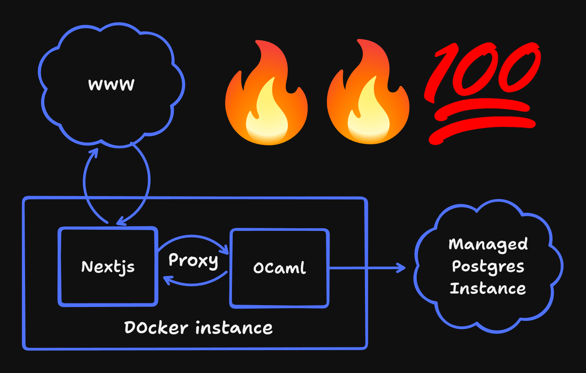

# daglig
~~ Beep boop ~~
## Architecture
The Nextjs server proxies requests for the CRUD server, this solves CORS and TLS certs annoyance. However, it does add ~10ms of latency and bottlenecks the OCaml server like crazy, it's fine though :sunglasses:


## WIP

### Frontend
- Setup cypress with auth, github token.

### Backend
- Setup https server httpun/eio

### Devops
- Setup postgres container
- Setup both servers in joint container
- local postgres container for dev, figure out how to automatically switch that out for fly.io postgres.
- Look into automatic deployment on fly.io

### Database
- Try out caqti-eio with ppx_rapper
- Integrate Oauth with db


## Backend

```sh
dune exec daglig
```

## Frontend

### Project Setup

```sh
npm install
```

### Compile and Hot-Reload for Development

```sh
npm run dev
```

### Compile, Minify and run for Production

```sh
npm run build
npm run start
```

### Lint with [ESLint](https://eslint.org/)

```sh
npm run lint
```

## Notes on testing

The backend uses inline unit tests through `ppx_expect` and  `ppx_assert` in [backend/lib/](backend/lib) and integration tests in [backend/test/](backend/test/)

The frontend uses `cypress` for e2e testing.